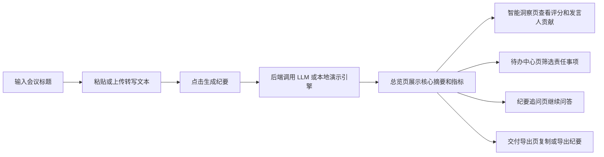
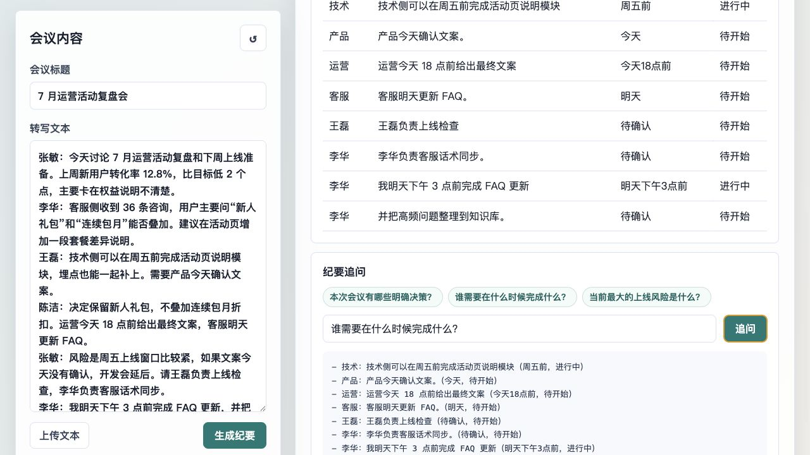
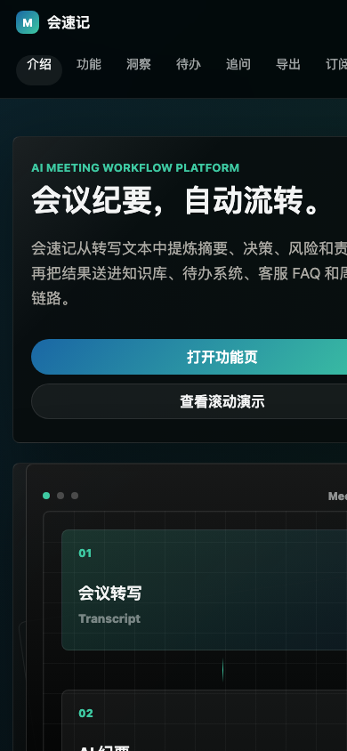

# 基于 AI 辅助工具的办公提效助手设计说明

## 1. 选题背景与场景描述

本项目选择“会议纪要助手”作为办公提效场景。实际工作中，项目周会、运营复盘会、需求评审会通常会产生大量口语化转写文本，人工整理纪要需要花费时间，并且容易遗漏决策、待办和风险。会速记的目标是把会议转写文本快速整理为可执行纪要，降低会后同步成本。

典型流程：

1. 项目经理或运营同学粘贴会议转写文本。
2. 系统生成结构化纪要，包含摘要、参会人、主题、关键决策、待办事项和风险。
3. 用户进入“智能洞察”查看会议评分、发言人贡献、转写统计和下一步建议。
4. 用户进入“待办中心”筛选责任事项，或进入“纪要追问”继续追问细节。
5. 用户在“交付导出”页面复制或导出纪要到飞书、邮件、项目管理系统或周报中。

## 2. 系统功能模块与交互流程

### 2.1 前端交互模块

- 会议标题输入：用于标记纪要主题。
- 转写文本输入：支持粘贴文本或上传 `.txt` 文件。
- 示例载入：方便没有真实材料时快速体验。
- 总览生成页：只展示输入、核心摘要和关键指标，保持首屏简洁。
- 产品介绍页：采用长滚动叙事展示核心能力，用户向下滑动时设备模型、光效、文案和功能点同步变化。
- 智能洞察页：结合决策数量、待办完整度、风险情况和参会覆盖度计算会议质量分，并展示发言人贡献、转写统计和下一步建议。
- 待办中心页：集中展示关键决策、风险提醒和责任事项，支持按任务状态筛选。
- 纪要追问页：根据已生成纪要继续问答。
- 交付导出页：支持复制纪要、导出 Markdown 和 JSON。
- 订阅方案页：提供个人版、团队版、企业版，体现产品商业化设计。

### 2.2 后端处理模块

- `/api/minutes`：接收会议标题和转写文本，返回结构化纪要。
- `/api/ask`：接收纪要结果和用户追问，返回基于纪要上下文的回答。
- 静态资源服务：提供前端页面。

### 2.3 用户使用流程



## 3. 技术方案及理由

### 3.1 Prompt 工程

项目默认采用 Prompt 工程方式接入大语言模型。System Prompt 明确要求模型扮演“企业办公会议纪要助手”，并要求只输出 JSON，字段包含 `summary`、`participants`、`decisions`、`actionItems`、`risks` 等。这样前端可以稳定渲染，也便于后续扩展为表格导出或任务系统同步。

选择理由：

- 会议纪要结构相对清晰，Prompt 工程即可覆盖大部分需求。
- 实现成本低，便于在短时间内完成可运行原型。
- JSON 输出能降低前后端对接复杂度。

### 3.2 检索增强思路

当前版本的追问模块把已生成的结构化纪要作为知识上下文，针对“决策、待办、风险、参会人”等问题进行定向检索回答。后续可扩展为真正的 RAG：将历史会议纪要、项目文档、FAQ 切分成片段并建立向量索引，在追问时召回相关片段后再交给 LLM 总结。

选择理由：

- 当前场景主要围绕单次会议内容追问，结构化结果已经是高价值知识。
- 先实现轻量检索，避免为了演示引入过重依赖。
- 保留升级空间，适合从 Prompt 方案平滑演进到 RAG。

### 3.3 本地兜底引擎

如果未配置 `LLM_API_KEY`，系统使用本地规则引擎识别参会人、决策关键词、待办关键词、风险关键词和截止时间。这样现场演示无需联网或付费 API，仍能满足本地运行体验。

### 3.4 前端增强分析

为了让工具不仅能“生成文本”，还具备运营工作台价值，前端在结构化纪要基础上增加二次分析：

- 会议质量评分：根据决策、待办、责任人、截止时间、风险数量和发言人覆盖度计算得分。
- 发言人贡献分析：按发言文本长度生成贡献条，辅助观察会议参与度。
- 转写统计：展示字符数、段落数、句子数和发言人数量。
- 下一步建议：根据未完成待办和主要风险生成后续推进动作。
- 交付导出：把结构化结果导出为 Markdown 或 JSON，方便进入周报、邮件或任务系统。

### 3.5 多视图交互设计

项目将复杂功能拆为五个视图：

- 总览生成：承担输入、生成和结果概览，是用户打开系统后的主路径。
- 产品介绍：用类似 Apple 产品页的滚动演示，把“输入会议、提炼结构、智能洞察、会后推进”的价值分段展示。
- 智能洞察：承载评分、发言人贡献、议题标签和转写统计。
- 待办中心：承载决策、风险、待办筛选，适合会后执行跟进。
- 纪要追问：承载上下文问答，避免追问区域挤占首页。
- 交付导出：承载 Markdown / JSON 导出和交付预览。
- 订阅方案：以产品化套餐方式展示个人、团队、企业三类使用场景。

视觉风格参考 Apple Store 官网：顶部轻量导航、浅灰页面背景、大字号标题、白色产品卡片和克制的蓝色主操作按钮，让页面更像产品官网，而不是后台系统。页面加入滚动进入视口的渐入、上移动效，以及导航栏滚动层次变化，增强向下浏览时的产品展示感。

## 4. 使用示例

### 4.1 输入内容

```text
张敏：今天讨论 7 月运营活动复盘和下周上线准备。上周新用户转化率 12.8%，比目标低 2 个点，主要卡在权益说明不清楚。
李华：客服侧收到 36 条咨询，用户主要问“新人礼包”和“连续包月”能否叠加。建议在活动页增加一段套餐差异说明。
王磊：技术侧可以在周五前完成活动页说明模块，埋点也能一起补上。需要产品今天确认文案。
陈洁：决定保留新人礼包，不叠加连续包月折扣。运营今天 18 点前给出最终文案，客服明天更新 FAQ。
```

### 4.2 对应输出

- 摘要：会议围绕转化率、客服咨询、活动页说明、文案和上线安排展开。
- 关键决策：保留新人礼包，不叠加连续包月折扣；本周五灰度上线。
- 待办事项：王磊负责上线检查；李华负责 FAQ 更新和客服话术同步；运营今天 18 点前给出最终文案。
- 风险提醒：如果文案今天没有确认，开发会延后，影响周五上线窗口。
- 智能评分：根据会议决策、待办和风险完整度生成质量分。
- 发言人贡献：展示张敏、李华、王磊、陈洁的发言贡献条。
- 下一步建议：优先推进待办、设置风险检查点、同步到项目群。

桌面端输出截图：



移动端输出截图：



### 4.3 追问示例

问题：谁需要在什么时候完成什么？

回答：

```text
- 王磊：负责上线检查（周五前，待开始）
- 李华：完成 FAQ 更新，并把高频问题整理到知识库（明天下午3点前，进行中）
- 运营：给出最终文案（今天18点前，待开始）
```

## 5. 评判关注点对应说明

- 实用性：解决会议后人工整理耗时、结论遗漏、责任不清的问题。
- 场景设计合理性：符合项目周会、运营复盘、需求评审等真实办公流程。
- 交互设计：提供文本输入、文件上传、结构化展示、智能评分、待办筛选、复制导出和多轮追问。
- 技术方案匹配度：以 Prompt 工程完成主要生成任务，以结构化纪要支持轻量检索增强追问，后续可扩展 RAG。
